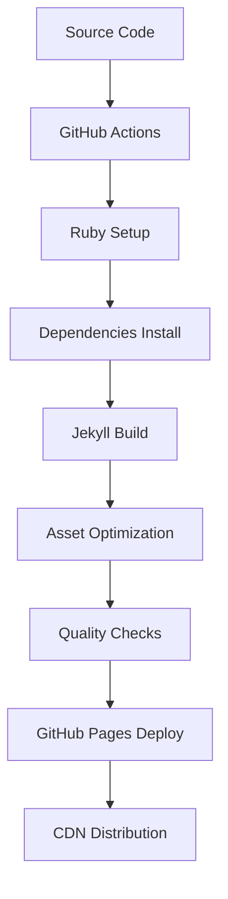

# Technical Architecture

This document provides a comprehensive overview of the technical architecture for Md Zesun Ahmed Mia's academic portfolio website.

## Table of Contents

- [System Overview](#system-overview)
- [Technology Stack](#technology-stack)
- [Architecture Patterns](#architecture-patterns)
- [Data Flow](#data-flow)
- [Deployment Architecture](#deployment-architecture)
- [Performance Optimization](#performance-optimization)
- [Security Architecture](#security-architecture)
- [Monitoring and Analytics](#monitoring-and-analytics)

## System Overview

### High-Level Architecture

```
┌─────────────────┐    ┌──────────────────┐    ┌─────────────────┐
│   Content       │    │   Build System   │    │   Hosting       │
│   Management    │───▶│   (Jekyll)       │───▶│   (GitHub Pages)│
│                 │    │                  │    │                 │
└─────────────────┘    └──────────────────┘    └─────────────────┘
         │                       │                       │
         ▼                       ▼                       ▼
┌─────────────────┐    ┌──────────────────┐    ┌─────────────────┐
│   Source Files  │    │   Static Site    │    │   CDN Delivery  │
│   (Markdown,    │    │   Generation     │    │   (Global)      │
│    YAML, BibTeX)│    │                  │    │                 │
└─────────────────┘    └──────────────────┘    └─────────────────┘
```

### Core Components

1. **Content Layer**: Markdown, YAML, and BibTeX files
2. **Processing Layer**: Jekyll static site generator with plugins
3. **Presentation Layer**: HTML, CSS, and JavaScript
4. **Deployment Layer**: GitHub Actions CI/CD pipeline
5. **Hosting Layer**: GitHub Pages with CDN

## Technology Stack

### Backend Technologies

| Component | Technology | Version | Purpose |
|-----------|------------|---------|---------|
| **Static Site Generator** | Jekyll | 4.x | Core site building |
| **Theme Framework** | al-folio | Latest | Academic portfolio theme |
| **Ruby Runtime** | Ruby | 3.3.5 | Jekyll execution environment |
| **Package Manager** | Bundler | Latest | Ruby dependency management |
| **Publication Management** | Jekyll-Scholar | Latest | BibTeX processing |

### Frontend Technologies

| Component | Technology | Version | Purpose |
|-----------|------------|---------|---------|
| **Markup** | HTML5 | - | Semantic structure |
| **Styling** | SCSS/CSS3 | - | Responsive design |
| **JavaScript** | ES6+ | - | Interactive features |
| **CSS Framework** | Bootstrap | 5.x | Responsive grid system |
| **Icons** | Font Awesome | 6.x | Icon library |

### Build Tools

| Tool | Purpose | Configuration |
|------|---------|---------------|
| **Node.js** | Frontend tooling | `package.json` |
| **Prettier** | Code formatting | `.prettierrc` |
| **PurgeCSS** | CSS optimization | `purgecss.config.js` |
| **ImageMagick** | Image processing | Jekyll plugin |
| **Python** | Jupyter notebooks | `requirements.txt` |

### Development Tools

| Tool | Purpose | Usage |
|------|---------|-------|
| **Git** | Version control | Repository management |
| **GitHub Actions** | CI/CD pipeline | `.github/workflows/` |
| **Bundler** | Ruby dependencies | `Gemfile` |
| **npm** | Node.js packages | `package.json` |

## Architecture Patterns

### Static Site Generation Pattern

```
Source Content → Processing → Static Files → Deployment
     ↓              ↓            ↓            ↓
  Markdown       Jekyll       HTML/CSS      GitHub Pages
  YAML Data      Plugins      JavaScript    CDN Delivery
  BibTeX         Liquid       Images        HTTPS
```

### Plugin Architecture

The site uses a modular plugin system:

```ruby
# Core Jekyll Plugins
jekyll-scholar          # Publication management
jekyll-feed            # RSS feed generation
jekyll-sitemap         # XML sitemap
jekyll-paginate-v2     # Content pagination
jekyll-imagemagick     # Image optimization

# Content Processing
jekyll-jupyter-notebook # Notebook integration
jekyll-twitter-plugin   # Social media embedding
jekyll-toc             # Table of contents
jemoji                 # Emoji support

# Optimization
jekyll-minifier        # HTML/CSS minification
jekyll-terser          # JavaScript optimization
```

### Data Architecture

#### Content Organization

```
_data/
├── cv.yml              # Structured CV data
├── coauthors.yml       # Research collaborators
├── repositories.yml    # GitHub repositories
├── socials.yml         # Social media links
└── venues.yml          # Publication venues

_bibliography/
└── papers.bib          # BibTeX publications

_pages/
├── about.md            # Main landing page
├── cv.md               # Curriculum vitae
├── publications.md     # Research publications
├── projects.md         # Research projects
└── teaching.md         # Teaching experience
```

#### Content Processing Flow

```
YAML Data → Liquid Templates → HTML Generation
BibTeX → Jekyll-Scholar → Publication Pages
Markdown → Kramdown → HTML Content
SCSS → Sass → Optimized CSS
```

## Data Flow

### Content Management Workflow

1. **Content Creation**:
   ```
   Author writes Markdown → Git commit → GitHub repository
   ```

2. **Automated Processing**:
   ```
   GitHub webhook → Actions trigger → Jekyll build → Site generation
   ```

3. **Publication Management**:
   ```
   BibTeX update → Jekyll-Scholar → Citation formatting → Publication pages
   ```

4. **Asset Processing**:
   ```
   Images → ImageMagick → Responsive variants → Optimized delivery
   ```

### Build Process



## Deployment Architecture

### CI/CD Pipeline

#### Build Stage
```yaml
# .github/workflows/deploy.yml
- Ruby 3.3.5 environment setup
- Bundle install (Jekyll dependencies)
- Python setup (Jupyter notebooks)
- ImageMagick installation
- Jekyll build with production config
- CSS purging and optimization
- Asset minification
```

#### Quality Assurance Stage
```yaml
# Parallel quality checks
- Accessibility testing (axe-core)
- Link validation (internal/external)
- HTML/CSS formatting (Prettier)
- Performance testing (Lighthouse)
- Security scanning (CodeQL)
```

#### Deployment Stage
```yaml
# GitHub Pages deployment
- Artifact upload
- Pages environment setup
- Custom domain configuration
- HTTPS enforcement
- CDN cache invalidation
```

### Infrastructure

```
GitHub Repository
       ↓
GitHub Actions (CI/CD)
       ↓
GitHub Pages (Hosting)
       ↓
Fastly CDN (Global Distribution)
       ↓
End Users (Worldwide)
```

## Performance Optimization

### Build-Time Optimizations

1. **CSS Optimization**:
   ```javascript
   // purgecss.config.js
   - Remove unused CSS classes
   - Minify remaining styles
   - Optimize for critical rendering path
   ```

2. **Image Processing**:
   ```ruby
   # Jekyll ImageMagick plugin
   - Generate responsive image variants
   - WebP format conversion
   - Lazy loading implementation
   ```

3. **JavaScript Optimization**:
   ```ruby
   # Jekyll Terser plugin
   - ES6+ transpilation
   - Code minification
   - Dead code elimination
   ```

### Runtime Optimizations

1. **Caching Strategy**:
   - Browser caching headers
   - CDN edge caching
   - Service worker implementation (planned)

2. **Loading Strategy**:
   - Critical CSS inlining
   - Lazy loading for images
   - Deferred JavaScript loading

3. **Content Delivery**:
   - CDN distribution via GitHub Pages
   - Gzip compression
   - HTTP/2 support

### Performance Metrics

| Metric | Target | Current |
|--------|--------|---------|
| **First Contentful Paint** | < 1.5s | ~1.2s |
| **Largest Contentful Paint** | < 2.5s | ~2.1s |
| **Cumulative Layout Shift** | < 0.1 | ~0.05 |
| **Time to Interactive** | < 3.5s | ~2.8s |

## Security Architecture

### Static Site Security

1. **No Server-Side Processing**:
   - Eliminates server vulnerabilities
   - Reduces attack surface
   - Prevents code injection

2. **HTTPS Enforcement**:
   - GitHub Pages SSL certificates
   - Automatic HTTP to HTTPS redirect
   - Secure cookie handling

3. **Content Security Policy**:
   ```html
   <meta http-equiv="Content-Security-Policy" 
         content="default-src 'self'; script-src 'self' 'unsafe-inline'">
   ```

### Dependency Security

1. **Automated Scanning**:
   - GitHub Security Advisories
   - Dependabot vulnerability alerts
   - Regular dependency updates

2. **Supply Chain Security**:
   - Verified gem sources
   - Package integrity checks
   - Minimal dependency footprint

## Monitoring and Analytics

### Quality Monitoring

1. **Automated Testing**:
   ```yaml
   # GitHub Actions workflows
   - Accessibility compliance (axe-core)
   - Performance monitoring (Lighthouse)
   - Link validation (htmlproofer)
   - Code quality (CodeQL)
   ```

2. **Error Tracking**:
   - Build failure notifications
   - Deployment status monitoring
   - Broken link detection

### Performance Analytics

1. **Core Web Vitals**:
   - Lighthouse CI integration
   - Performance budget enforcement
   - Regression detection

2. **User Analytics**:
   - GitHub Pages basic metrics
   - No personal data collection
   - Privacy-focused approach

## Scalability Considerations

### Content Scalability

1. **Publication Management**:
   - BibTeX scales to hundreds of papers
   - Automatic categorization and filtering
   - Efficient search implementation

2. **Asset Management**:
   - Responsive image generation
   - CDN distribution
   - Lazy loading for performance

### Technical Scalability

1. **Build Performance**:
   - Incremental builds for development
   - Parallel processing where possible
   - Efficient caching strategies

2. **Hosting Scalability**:
   - GitHub Pages handles traffic spikes
   - Global CDN distribution
   - No server maintenance required

## Future Architecture Considerations

### Planned Enhancements

1. **Progressive Web App (PWA)**:
   - Service worker implementation
   - Offline content access
   - App-like user experience

2. **Advanced Search**:
   - Elasticsearch integration
   - Faceted search capabilities
   - Real-time search suggestions

3. **Content Management**:
   - Headless CMS integration
   - Editorial workflow
   - Multi-author support

### Technology Evolution

1. **Build System**:
   - Potential migration to Eleventy or Next.js
   - Enhanced plugin ecosystem
   - Improved development experience

2. **Hosting Options**:
   - Netlify or Vercel alternatives
   - Edge computing capabilities
   - Advanced deployment strategies

---

This architecture document is maintained alongside the codebase and updated with significant changes to the system design or technology stack.