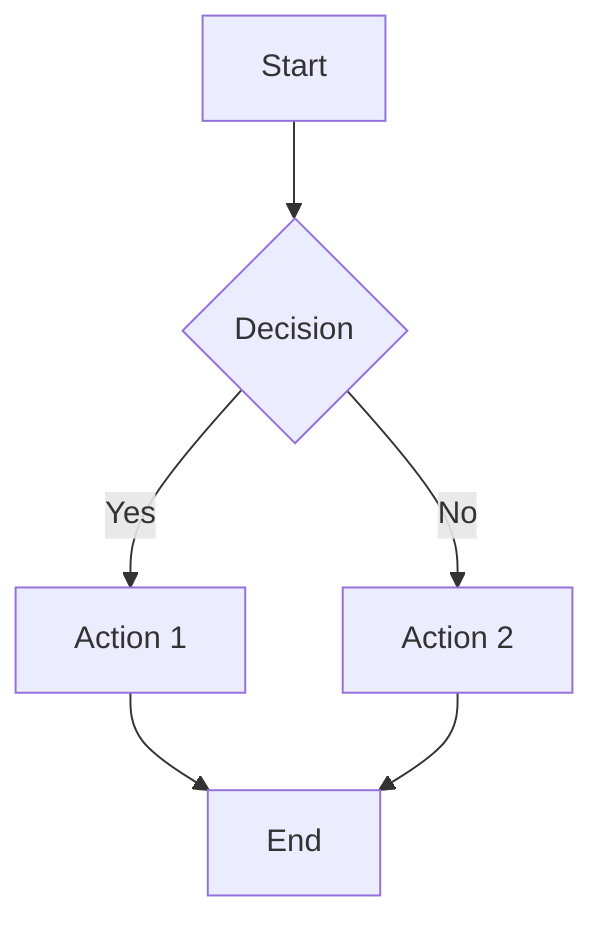

# Complete Blog Post Template Guide

**INSTRUCTIONS: This is a comprehensive template for creating blog posts. Copy this file, rename it following the format `YYYY-MM-DD-post-title.md`, and customize the content. Remember to set `published: true` and `category: blog` when ready to publish.**

## Front Matter Configuration

The front matter (YAML) at the top of your post controls many features. Here are the key variables:

### Required Variables

```yaml
layout: post # Always use 'post' for blog posts
title: "Your Post Title" # Use quotes if title contains special characters
date: YYYY-MM-DD HH:MM:SS-TTTT # Format: 2025-01-15 10:00:00-0500
description: "SEO description" # Brief description for search engines and previews
published: true # Set to false to hide the post
category: blog # Use 'blog' for published posts, 'hidden' for drafts
```

### Optional Variables

```yaml
tags: tag1 tag2 tag3 # Space-separated tags (no quotes needed)
categories: category1 category2 # Space-separated categories
giscus_comments: true # Enable comments (requires Giscus setup)
related_posts: true # Show related posts at bottom
featured: true # Mark as featured post
thumbnail: assets/img/pic.jpg # Thumbnail image for post previews
redirect: /some/path # Redirect this post to another URL
```

## Writing Content

### Headers

Use markdown headers to organize your content:

```markdown
# Main Title (H1) - Usually for the post title

## Major Section (H2)

### Subsection (H3)

#### Minor Section (H4)
```

## Major Section (H2)

### Subsection (H3)

#### Minor Section (H4)

### Text Formatting

**Bold text** using `**bold text**`  
_Italic text_ using `*italic text*`  
~~Strikethrough~~ using `~~strikethrough~~`  
`Inline code` using backticks

### Links and References

- [External link](https://example.com)
- [Internal link to another post]()
- [Link to page](/cv/)
- Email link: <zesun.ahmed@psu.edu>

### Lists

**Unordered lists:**

- Item 1
- Item 2
  - Sub-item 2.1
  - Sub-item 2.2
- Item 3

**Ordered lists:**

1. First item
2. Second item
3. Third item

**Task lists:**

- [x] Completed task
- [ ] Pending task
- [ ] Another pending task

### Blockquotes

> This is a regular blockquote.
> You can include multiple lines.

**Special blockquotes** (add `{: .block-tip}`, `{: .block-warning}`, or `{: .block-danger}` after):

> ##### TIP
>
> This is a helpful tip for readers.
> {: .block-tip }

> ##### WARNING
>
> This is a warning about something important.
> {: .block-warning }

> ##### DANGER
>
> This indicates something potentially dangerous or critical.
> {: .block-danger }

## Code Examples

### Inline Code

Use backticks for `inline code` within sentences.

### Code Blocks

```python
def hello_world():
    """A simple Python function."""
    print("Hello, world!")
    return True

# Call the function
result = hello_world()
```

```bash
# Shell commands
git clone https://github.com/user/repo.git
cd repo
make install
```

### Code with Line Numbers


def fibonacci(n):
if n <= 1:
return n
return fibonacci(n-1) + fibonacci(n-2)

# Generate first 10 Fibonacci numbers

for i in range(10):
print(f"F({i}) = {fibonacci(i)}")


## Mathematical Expressions

### Inline Math

Use single or double dollar signs: $E = mc^2$ or $$F = ma$$

### Display Math

$$
\begin{align}
\nabla \times \vec{\mathbf{B}} -\, \frac1c\, \frac{\partial\vec{\mathbf{E}}}{\partial t} &= \frac{4\pi}{c}\vec{\mathbf{j}} \\
\nabla \cdot \vec{\mathbf{E}} &= 4 \pi \rho \\
\nabla \times \vec{\mathbf{E}}\, +\, \frac1c\, \frac{\partial\vec{\mathbf{B}}}{\partial t} &= \vec{\mathbf{0}} \\
\nabla \cdot \vec{\mathbf{B}} &= 0
\end{align}
$$

## Images and Media

### Basic Images

```liquid

```

### Zoomable Images

```liquid

```

### Image Galleries

```html
<div class="row mt-3">
  <div class="col-sm mt-3 mt-md-0">
    
  </div>
  <div class="col-sm mt-3 mt-md-0">
    
  </div>
</div>
<div class="caption">Caption for the image gallery.</div>
```

### Videos

```liquid

```

### Audio

```liquid

```

## Advanced Features

### Table of Contents

Add to front matter:

```yaml
toc:
  beginning: true # TOC at the beginning of post
  # OR
  sidebar: left # TOC in left sidebar (or 'right')
```

### Tables

Enable pretty tables in front matter: `pretty_table: true`

| Left aligned | Center aligned | Right aligned |
| :----------- | :------------: | ------------: |
| Left 1       |    center 1    |       right 1 |
| Left 2       |    center 2    |       right 2 |
| Left 3       |    center 3    |       right 3 |

### Citations and Bibliography

Enable in front matter: `related_publications: true`

```liquid


```

### Diagrams with Mermaid

Enable in front matter:

```yaml
mermaid:
  enabled: true
  zoomable: true
```



### Interactive Charts

#### Chart.js

Enable in front matter: `chart: { chartjs: true }`

```chartjs
{
  "type": "line",
  "data": {
    "labels": ["Jan", "Feb", "Mar", "Apr", "May"],
    "datasets": [{
      "label": "Data",
      "data": [12, 19, 3, 5, 2],
      "borderColor": "rgb(75, 192, 192)"
    }]
  }
}
```

#### Plotly

Enable in front matter: `chart: { plotly: true }`

```plotly
{
  "data": [{
    "x": [1, 2, 3, 4],
    "y": [10, 15, 13, 17],
    "type": "scatter"
  }],
  "layout": {
    "title": "Sample Plot"
  }
}
```

### Tabs

Enable in front matter: `tabs: true`



````liquid


```python
print("Hello from Python!")
````




```javascript
console.log("Hello from JavaScript!");
```




````


### Code Diffs
Enable in front matter: `code_diff: true`

```diff2html
diff --git a/file.py b/file.py
index 1234567..abcdefg 100644
--- a/file.py
+++ b/file.py
@@ -1,3 +1,3 @@
 def hello():
-    print("Hello World")
+    print("Hello Universe")
     return True
````

## SEO and Sharing

### Description

Always include a compelling description in the front matter for better SEO and social sharing.

### Tags and Categories

Use relevant tags and categories to help readers find related content:

- **Tags**: Specific topics (e.g., "python", "machine-learning", "tutorial")
- **Categories**: Broader themes (e.g., "research", "personal", "tutorials")

### Featured Posts

Set `featured: true` to highlight important posts.

## Publishing Checklist

Before publishing your post:

1. **Content Review**

   - [ ] Proofread for spelling and grammar
   - [ ] Check all links work correctly
   - [ ] Verify images display properly
   - [ ] Test any code examples

2. **Front Matter**

   - [ ] Set `published: true`
   - [ ] Change `category` from "hidden" to appropriate category
   - [ ] Add relevant tags
   - [ ] Include compelling description
   - [ ] Set appropriate date

3. **File Naming**

   - [ ] File named as `YYYY-MM-DD-post-title.md`
   - [ ] Post title matches filename

4. **Optional Features**
   - [ ] Enable comments if desired (`giscus_comments: true`)
   - [ ] Add table of contents if helpful
   - [ ] Include featured image/thumbnail
   - [ ] Mark as featured if appropriate

## Tips for Great Blog Posts

### Content Tips

- **Start with an engaging introduction** that hooks the reader
- **Use clear, descriptive headers** to organize your content
- **Include practical examples** and real-world applications
- **End with a conclusion** that summarizes key points
- **Encourage engagement** by asking questions or requesting feedback

### Technical Tips

- **Optimize images** before uploading (reasonable file sizes)
- **Test all interactive elements** (charts, videos, etc.)
- **Use appropriate markdown formatting** for readability
- **Include alt text** for images for accessibility

### Jekyll-Specific Tips

- **Preview locally** before publishing using `bundle exec jekyll serve`
- **Check the site builds correctly** after publishing
- **Use liquid includes** for consistent formatting
- **Follow the existing site structure** and conventions

---

## Example Post Structure

Here's a recommended structure for academic/research blog posts:

```markdown
---
# Front matter here
---

# Engaging Title

Brief introduction that hooks the reader and explains what they'll learn.

## Background/Context

Provide necessary background information.

## Main Content Section 1

Detailed explanation with examples, code, or images.

### Subsection

More specific details.

## Main Content Section 2

Continue with main points.

## Practical Applications/Examples

Show real-world applications or provide hands-on examples.

## Challenges and Solutions

Discuss any challenges encountered and how they were solved.

## Conclusion

Summarize key points and suggest next steps or further reading.

## References/Further Reading

- Link 1
- Link 2

---

_Questions or comments? I'd love to hear from you in the comments below!_
```

**Remember**: This template file should remain hidden (`published: false`, `category: hidden`). When creating a new post, copy this content to a new file and customize it for your specific post topic.
